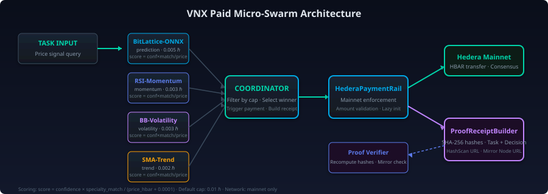

# Hedera VNX Paid Micro-Swarm

<p align="center">
  
  
  
  
</p>

<p align="center">
  <strong>Deterministic agent swarm with Hedera mainnet HBAR payment and cryptographically verifiable proof receipts.</strong>
</p>

<p align="center">
  <a href="#quick-start">Quick Start</a> ·
  <a href="#architecture">Architecture</a> ·
  <a href="#proof-verification">Verification</a> ·
  <a href="#tests">Tests</a> ·
  <a href="#docs">Docs</a>
</p>

---

## Overview

```
Task → 4 VNX Workers Vote → Highest-Score Winner → HBAR Paid on Mainnet → Cryptographic Receipt
```

The VNX Paid Micro-Swarm is a deterministic, competition-grade system that dispatches trading-signal tasks to a swarm of specialized agent workers, selects the highest-confidence winner, pays them in HBAR on Hedera mainnet, and produces a **cryptographically verifiable proof receipt** with SHA-256 hashes and live mirror-node confirmation.

**Live Verification**

| Resource | Link / ID |
|----------|-------------|
| **HCS Topic** | `0.0.10416185` — Vera lattice audit trail |
| **Account** | `0.0.10294360` |
| **Mirror Node** | `https://mainnet-public.mirrornode.hedera.com` |
| **HashScan** | `https://hashscan.io/mainnet` |

---

## Quick Start

### Prerequisites

- Node.js ≥ 20
- `npm` or `pnpm`

### Install

```bash
git clone https://github.com/your-org/hedera-vnx-paid-swarm.git
cd hedera-vnx-paid-swarm
npm install
```

### Plan-Only Mode (no credentials)

Preview the entire swarm logic without touching the network:

```bash
npm run demo:plan
```

### Live Mainnet (requires credentials)

```bash
# Copy and fill in your credentials
cp .env.example .env
# edit .env with HEDERA_ACCOUNT_ID, HEDERA_PRIVATE_KEY, HEDERA_NETWORK=mainnet

npm run demo:live -- \
  --task "Predict the HBAR price direction and forecast the signal" \
  --recipient 0.0.RECIPIENT \
  --max-hbar 0.01
```

---

## Architecture

<p align="center">
  
</p>

<p align="center">
  
</p>

### Component Reference

| Component | File | Responsibility |
|-----------|------|--------------|
| `VnxWorkerAgent` | [`src/workers.ts`](src/workers.ts) | 4 deterministic agents with keyword confidence scoring |
| `PaidSwarmCoordinator` | [`src/coordinator.ts`](src/coordinator.ts) | Dispatches tasks, scores votes, selects winner, triggers payment |
| `HederaPaymentRail` | [`src/payment-rail.ts`](src/payment-rail.ts) | Wraps `HederaClient`; enforces mainnet, validates amount cap |
| `ProofReceiptBuilder` | [`src/receipt-builder.ts`](src/receipt-builder.ts) | SHA-256 hashed JSON receipt with HashScan + mirror-node URLs |
| `ProofVerifier` | [`src/proof-verifier.ts`](src/proof-verifier.ts) | Recomputes hashes and verifies transactions via Hiero mirror node |

### Worker Swarm

| Name | Specialty | Price | Best For |
|------|-----------|-------|----------|
| **BitLattice-ONNX** | prediction | 0.005 HBAR | price signals, forecasts |
| **RSI-Momentum** | momentum | 0.003 HBAR | RSI, velocity tasks |
| **BB-Volatility** | volatility | 0.003 HBAR | Bollinger bands, range |
| **SMA-Trend** | trend | 0.002 HBAR | moving average, slope |

**Scoring Formula:** `score = confidence × specialty_match / (price_hbar + 0.0001)`

---

## Receipt Schema

```json
{
  "version": "1.0",
  "network": "mainnet",
  "timestamp": 1778958345039,
  "taskHash": "d8779ea3f6750d565f07d5e014cd2b8ddc8b12b46847e9f981d90a7d42cba583",
  "votes": [
    { "workerId": "onnx-primary", "name": "BitLattice-ONNX", "specialty": "prediction", "confidence": 0.9, "priceHbar": 0.005, "score": 176.47 }
  ],
  "selected": { "workerId": "onnx-primary", "name": "BitLattice-ONNX", "specialty": "prediction", "priceHbar": 0.005, "score": 176.47 },
  "payment": {
    "status": "success",
    "transactionId": "0.0.10294360@1778958335.880736678",
    "network": "mainnet",
    "amountHbar": 0.005,
    "recipient": "0.0.10294360",
    "consensusTimestampMs": 1778958345039
  },
  "decisionHash": "sha256(workerId:score:txId:taskHash)",
  "proofStatus": "mainnet_confirmed",
  "explorerUrl": "https://hashscan.io/mainnet/transaction/...",
  "mirrorNodeUrl": "https://mainnet-public.mirrornode.hedera.com/api/v1/transactions/..."
}
```

See [`data/receipt-example.json`](data/receipt-example.json) for a full verified example.

---

## Proof Verification

### CLI

```bash
npm run verify -- \
  --receipt data/receipt-example.json \
  --task "Predict the HBAR price direction and forecast the signal"
```

**Expected Output:**

```text
PASS  TASK HASH
PASS  DECISION HASH
PASS  MAINNET PROOF STATUS
PASS  HASHSCAN URL
PASS  MIRROR NODE TRANSACTION

Proof verification passed.
```

### Programmatic

```typescript
import { verifySwarmProof } from 'hedera-vnx-paid-swarm';

const result = await verifySwarmProof(receipt, taskDescription);
// result.ok: boolean
// result.checks: Array<{ name, ok, detail }>
```

The verifier performs **5 independent checks**:

1. **Task Hash** — Recomputes SHA-256 of the original task description
2. **Decision Hash** — Recomputes `SHA-256(workerId:score:txId:taskHash)`
3. **Mainnet Proof Status** — Validates `proofStatus === "mainnet_confirmed"`
4. **HashScan URL** — Confirms explorer URL matches transaction ID
5. **Mirror Node Transaction** — Live lookup to `mainnet-public.mirrornode.hedera.com`

See [`docs/HIERO.md`](docs/HIERO.md) for the full proof standard and mirror-node API details.

---

## Tests

```bash
npm test
```

**18 passing tests** covering:

- Worker confidence determinism and specialty keyword matching
- Winner selection by highest score
- Max-hbar cap filtering
- Plan-only mode (no payment)
- Payment failure normalization
- Non-mainnet network rejection
- Hash stability and proof status
- HashScan + mirror-node URL generation
- Hiero mirror-node transaction verification
- Tampered hash detection

```bash
npm run test:coverage   # coverage report
npm run test:watch      # watch mode
```

---

## Safety & Security

| Guarantee | Implementation |
|-----------|----------------|
| **Max Amount Cap** | Default `--max-hbar` at `0.01` HBAR; configurable but never unlimited |
| **Mainnet Enforcement** | `HEDERA_NETWORK=mainnet` required for competition runs; throws otherwise |
| **Positive Amount** | Rejects non-positive or zero amounts |
| **No Hardcoded Keys** | Private keys loaded exclusively from `HEDERA_PRIVATE_KEY` env var |
| **Plan-Only Isolation** | `--plan-only` mode explicitly labeled as dev-only; receipts show `proofStatus: "not_mainnet_proof"` |
| **Receipt Guards** | `assertMainnetProofReceipt()` prevents mock receipts from being treated as live proof |

---

## CLI Scripts

| Script | Command | Purpose |
|--------|---------|---------|
| Demo | `npm run demo:plan` | Preview swarm without credentials |
| Demo Live | `npm run demo:live` | Run on Hedera mainnet with real HBAR |
| E2E Dry | `npm run e2e` | Structural validation, no network calls |
| E2E Live | `npm run e2e:live` | Full live mainnet end-to-end run |
| Verify | `npm run verify -- --receipt <file> --task <text>` | Verify a saved receipt |

---

## Project Structure

```
hedera-vnx-paid-swarm/
├── src/
│   ├── types.ts              # Core interfaces (SwarmTask, WorkerVote, SwarmReceipt, PaymentRail)
│   ├── workers.ts            # VnxWorkerAgent + 4 pre-configured agents
│   ├── coordinator.ts        # PaidSwarmCoordinator
│   ├── payment-rail.ts       # HederaPaymentRail — mainnet enforcement
│   ├── receipt-builder.ts    # ProofReceiptBuilder — SHA-256 receipts
│   ├── proof-validation.ts   # assertMainnetProofReceipt guards
│   ├── proof-verifier.ts     # verifySwarmProof + Hiero mirror-node lookup
│   ├── proof-urls.ts         # HashScan + mirror-node URL builders
│   ├── hedera-client.ts      # Minimal HederaClient wrapper
│   └── index.ts              # Barrel exports
├── scripts/
│   ├── vnx-paid-swarm-demo.ts        # CLI demo entrypoint
│   ├── vnx-paid-swarm-e2e.ts         # End-to-end validation
│   └── vnx-paid-swarm-verify-proof.ts # CLI proof verifier
├── tests/
│   └── vnx-paid-swarm.test.ts        # 18 passing Jest tests
├── assets/
│   ├── architecture.svg      # System architecture diagram
│   ├── workflow.svg          # Execution flow diagram
│   ├── badge-swarm.svg       # VNX Swarm Protocol badge
│   ├── badge-hedera.svg      # Verified on Hedera Mainnet badge
│   ├── badge-hiero.svg       # Hiero Compatible badge
│   └── badge-tests.svg       # 18 Tests Passing badge
├── data/
│   └── receipt-example.json   # Verified example receipt
├── docs/
│   └── HIERO.md              # Hiero compatibility & verification guide
├── .env.example              # Environment variable template
├── CHANGELOG.md              # Version history
├── CONTRIBUTING.md           # Contribution guidelines
├── LICENSE                   # MIT License
└── package.json              # Scripts & dependencies
```

---

## HCS Topic

**Topic ID:** `0.0.10416185`

This is the Vera lattice HCS topic used for audit trail anchoring. Future releases will publish swarm receipts to this topic for immutable, consensus-timestamped settlement proof.

---

## Contributing

See [`CONTRIBUTING.md`](CONTRIBUTING.md) for development setup, style guide, and submission guidelines.

---

## License

[MIT](LICENSE) © Vera Lattice
