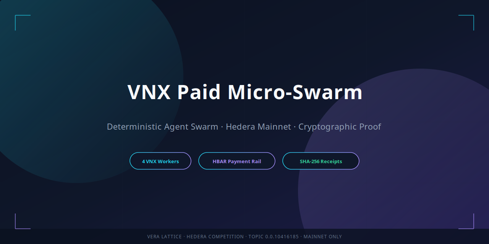
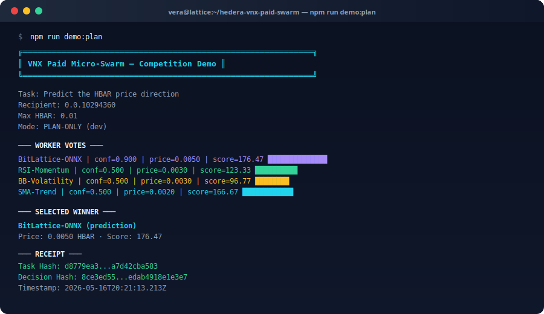
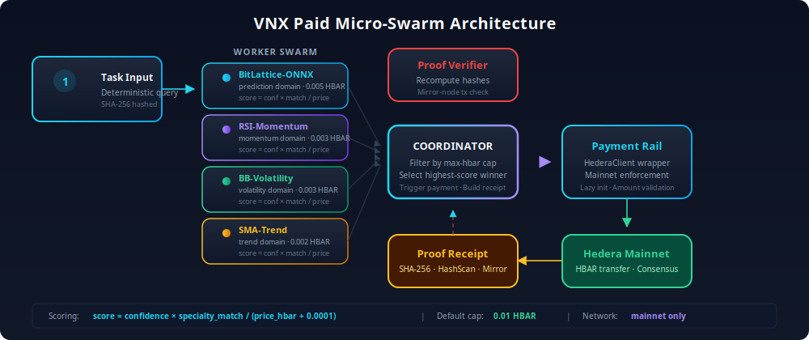
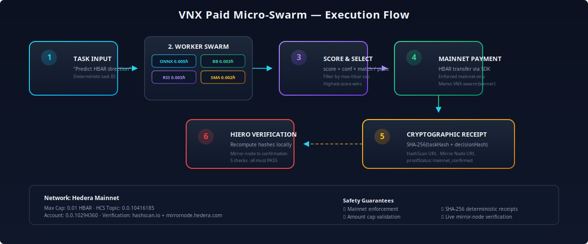
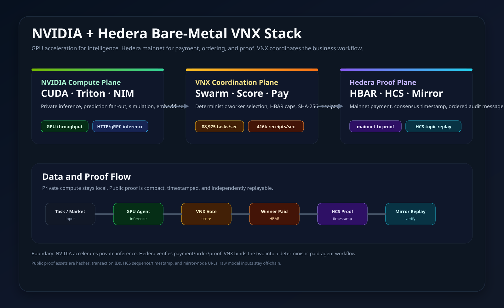
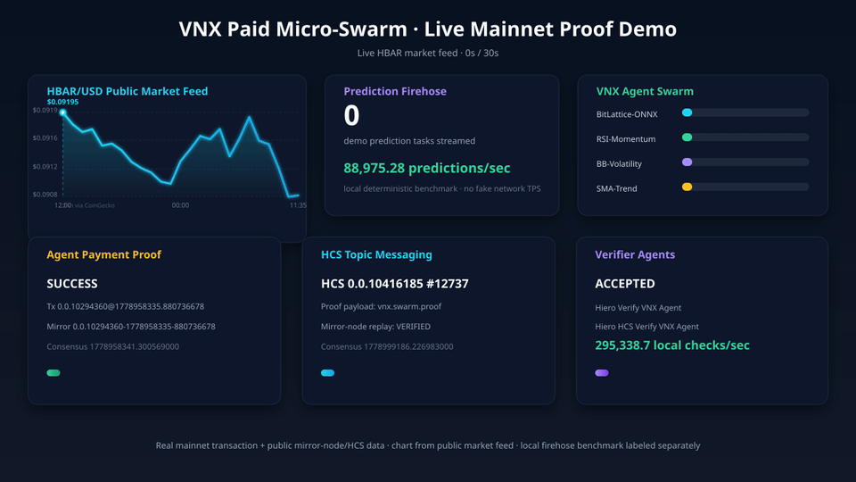
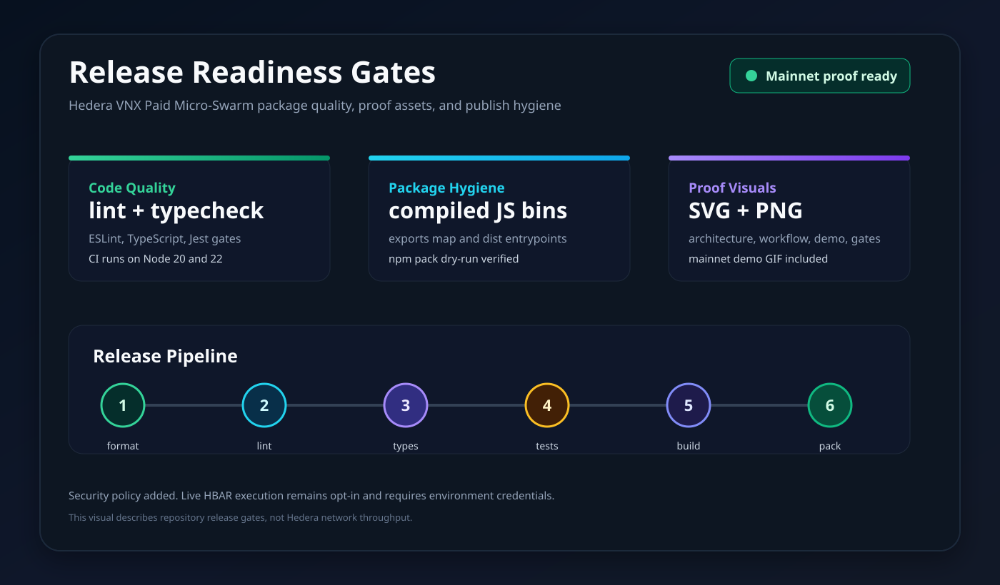
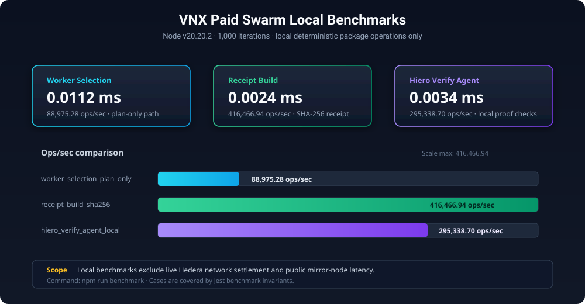

<p align="center">
  
</p>

<h1 align="center">Hedera VNX Paid Micro-Swarm</h1>

<p align="center">
  
  
  
  
</p>

<p align="center">
  <strong>Deterministic agent swarm with Hedera mainnet HBAR payment, cryptographically verifiable proof receipts, and a standalone Payment SDK for any HBAR transfer.</strong>
</p>

<p align="center">
  <a href="#quick-start">Quick Start</a> ·
  <a href="#architecture">Architecture</a> ·
  <a href="#nvidia--hedera-bare-metal">NVIDIA + Hedera</a> ·
  <a href="#live-mainnet-demo">Live Demo</a> ·
  <a href="#release-quality">Release Quality</a> ·
  <a href="#payment-sdk">Payment SDK</a> ·
  <a href="#hiero-verify-vnx-agent">Hiero Verify Agent</a> ·
  <a href="#benchmarks">Benchmarks</a> ·
  <a href="#tests">Tests</a> ·
  <a href="#docs">Docs</a>
</p>

---

## Overview

```
Task → 4 VNX Workers Vote → Highest-Score Winner → HBAR Paid on Mainnet → Cryptographic Receipt
```

The VNX Paid Micro-Swarm is a deterministic, competition-grade system that dispatches trading-signal tasks to a swarm of specialized agent workers, selects the highest-confidence winner, pays them in HBAR on Hedera mainnet, and produces a **cryptographically verifiable proof receipt** with SHA-256 hashes and live mirror-node confirmation.

**Features**

- **4 deterministic VNX workers** with keyword-based confidence scoring
- **HBAR payment rail** with mainnet enforcement and configurable amount caps
- **Standalone Payment SDK** — send HBAR from CLI or code without swarm logic
- **SHA-256 cryptographic receipts** with HashScan and mirror-node URLs
- **Hiero Verify VNX Agent** — 5 independent checks with live mirror-node confirmation
- **32 passing Jest tests** covering edge cases, tamper detection, HCS verification, demo rendering, verifier-agent verdicts, and benchmark invariants

**Live Verification**

| Resource                | Link / ID                                      |
| ----------------------- | ---------------------------------------------- |
| **HCS Topic**           | `0.0.10416185` — Vera lattice audit trail      |
| **Account**             | `0.0.10294360`                                 |
| **Payment Transaction** | `0.0.10294360@1778958335.880736678`            |
| **Mirror Node**         | `https://mainnet-public.mirrornode.hedera.com` |
| **HashScan**            | `https://hashscan.io/mainnet`                  |

---

## Quick Start

### Prerequisites

- Node.js ≥ 20
- `npm` or `pnpm`

### Install

```bash
git clone https://github.com/livevnx8/hedera-vnx-paid-swarm.git
cd hedera-vnx-paid-swarm
npm install
```

### Plan-Only Mode (no credentials)

Preview the entire swarm logic without touching the network:

```bash
npm run demo:plan
```

This runs the full flow without credentials — you see worker scores and the winner selection.

<p align="center">
  
</p>

### Live Mainnet (requires credentials)

```bash
# Copy and fill in your credentials
cp .env.example .env
# edit .env with HEDERA_ACCOUNT_ID, HEDERA_PRIVATE_KEY, HEDERA_NETWORK=mainnet

npm run demo:live -- \
  --task "Predict the HBAR price direction and forecast the signal" \
  --recipient 0.0.RECIPIENT \
  --max-hbar 0.01
```

---

## Architecture

<p align="center">
  
</p>

<p align="center">
  
</p>

### Component Reference

| Component              | File                                                     | Responsibility                                                     |
| ---------------------- | -------------------------------------------------------- | ------------------------------------------------------------------ |
| `VnxWorkerAgent`       | [`src/workers.ts`](src/workers.ts)                       | 4 deterministic agents with keyword confidence scoring             |
| `PaidSwarmCoordinator` | [`src/coordinator.ts`](src/coordinator.ts)               | Dispatches tasks, scores votes, selects winner, triggers payment   |
| `HederaPaymentRail`    | [`src/payment-rail.ts`](src/payment-rail.ts)             | Wraps `HederaClient`; enforces mainnet, validates amount cap       |
| `ProofReceiptBuilder`  | [`src/receipt-builder.ts`](src/receipt-builder.ts)       | SHA-256 hashed JSON receipt with HashScan + mirror-node URLs       |
| `ProofVerifier`        | [`src/proof-verifier.ts`](src/proof-verifier.ts)         | Recomputes hashes and verifies transactions via Hiero mirror node  |
| `HieroVerifyVnxAgent`  | [`src/hiero-verify-agent.ts`](src/hiero-verify-agent.ts) | Agent-style proof verdict for saved receipts                       |
| `BenchmarkRunner`      | [`src/benchmark.ts`](src/benchmark.ts)                   | Reproducible local benchmarks for deterministic package operations |

### NPM Package Architecture

```text
hedera-vnx-paid-swarm
├─ Public API
│  ├─ VnxWorkerAgent / DEFAULT_WORKERS
│  ├─ PaidSwarmCoordinator
│  ├─ HederaPaymentRail / HederaClient
│  ├─ ProofReceiptBuilder
│  ├─ HieroVerifyVnxAgent
│  ├─ HieroHcsVerifyAgent
│  ├─ runLocalBenchmarks
│  └─ fetchMainnetDemoData / renderMainnetDemoFrame
├─ CLI Tools
│  ├─ vnx-swarm-demo
│  ├─ vnx-swarm-e2e
│  ├─ vnx-swarm-verify
│  ├─ vnx-mainnet-demo
│  ├─ hcs-topic-publisher / hcs-verify-agent
│  ├─ send-hbar
│  └─ npm run benchmark
└─ Proof Data
   ├─ SHA-256 task and decision hashes
   ├─ HashScan transaction URL
   └─ Hedera/Hiero mirror-node confirmation
```

### Worker Swarm

| Name                | Specialty  | Price      | Best For                 |
| ------------------- | ---------- | ---------- | ------------------------ |
| **BitLattice-ONNX** | prediction | 0.005 HBAR | price signals, forecasts |
| **RSI-Momentum**    | momentum   | 0.003 HBAR | RSI, velocity tasks      |
| **BB-Volatility**   | volatility | 0.003 HBAR | Bollinger bands, range   |
| **SMA-Trend**       | trend      | 0.002 HBAR | moving average, slope    |

> Workers use deterministic keyword-confidence scoring to demonstrate the competitive dispatch pattern. They are designed to be replaced with real inference backends (ONNX, REST, gRPC) via the `VnxWorkerAgent` interface.

**Scoring Formula:** `score = confidence × specialty_match / (max(price_hbar, 0.001) + 0.0001)`

A minimum effective price of 0.001 HBAR prevents agents from gaming the formula by bidding near zero.

---

## NVIDIA + Hedera Bare Metal

> **Reference Architecture** — This section describes the target production stack. GPU-accelerated inference (Nemotron, TensorRT, NIM) is implemented in the companion [`nemotron-vnx-paid-swarm`](https://github.com/livevnx8/hedera-vnx-nvidia) repository. This package provides the deterministic task dispatch, payment, and proof layer that sits beneath the inference tier.

The business architecture is simple: **NVIDIA accelerates the intelligence, Hedera verifies the economic event, and VNX connects both into a paid agent workflow on Linux bare metal.** GPUs run the prediction and model-serving workloads locally; Hedera receives the compact proof artifacts: payments, task hashes, decision hashes, HCS messages, and mirror-node verification.

<p align="center">
  <picture>
    <source srcset="assets/nvidia-hedera-stack.svg" type="image/svg+xml"/>
    
  </picture>
</p>

| Layer                          | What it does in this stack                                                         | Why it matters                                                           |
| ------------------------------ | ---------------------------------------------------------------------------------- | ------------------------------------------------------------------------ |
| Linux bare metal               | Owns drivers, CUDA runtime, local services, logs, secrets, and process supervision | Low overhead and strong operational control                              |
| NVIDIA CUDA / Triton / NIM     | Runs accelerated inference, model endpoints, and high-throughput agent workloads   | Fast local prediction without putting private model inputs on-chain      |
| VNX swarm                      | Routes tasks, scores workers, selects winners, builds receipts, and pays agents    | Turns inference into a deterministic business workflow                   |
| Hedera HBAR + HCS              | Settles agent payments and anchors verifiable proof messages                       | Creates public, timestamped, independently auditable records             |
| Hiero mirror-node verification | Replays transaction and topic evidence after execution                             | Lets customers and operators verify outcomes without trusting our server |

Data points used honestly:

| Metric                         | Source                                                           | Value                                                                       |
| ------------------------------ | ---------------------------------------------------------------- | --------------------------------------------------------------------------- |
| NVIDIA NIM published example   | Llama 3.1 8B Instruct, 1x H100 SXM, FP8, 200 concurrent requests | NIM ON: 1201 tokens/s, ITL 32ms; NIM OFF: 613 tokens/s, ITL 37ms            |
| VNX local benchmark            | Deterministic plan-only worker selection on this repo            | 88,975.28 prediction tasks/sec                                              |
| VNX receipt benchmark          | SHA-256 task and decision receipt construction                   | 416,466.94 receipts/sec                                                     |
| VNX verifier benchmark         | Local Hiero verifier checks with mirror-node result injected     | 295,338.70 checks/sec                                                       |
| Hedera public mirror-node note | Hedera HCS API docs                                              | Public mainnet mirror node throttled at 100 requests/sec at time of writing |

What this unlocks:

- GPU-backed prediction desks with paid winner selection
- Enterprise AI audit trails without publishing private model inputs
- Agent marketplaces with HBAR settlement and reputation history
- Bare-metal AI appliances that produce customer-verifiable proof

See [`docs/NVIDIA_HEDERA_BARE_METAL.md`](docs/NVIDIA_HEDERA_BARE_METAL.md) for the detailed architecture, operator workflow, performance boundaries, and source references.

---

## Live Mainnet Demo

The demo GIF is rendered from public data sources: an existing Hedera mainnet payment transaction, the latest message from the Vera HCS topic, a public HBAR/USD market feed, and local deterministic benchmark results. Rendering the GIF does **not** submit a new payment or HCS message.

<p align="center">
  
</p>

Render it locally:

```bash
npm run demo:render -- \
  --transaction-id 0.0.10294360@1778958335.880736678 \
  --hcs-topic 0.0.10416185 \
  --out assets/vnx-mainnet-demo.gif
```

What the visual proves:

| Panel                 | Live or measured source                                            |
| --------------------- | ------------------------------------------------------------------ |
| Agent payment proof   | `0.0.10294360@1778958335.880736678` via public mirror node         |
| HCS topic messaging   | `0.0.10416185` latest topic message via public mirror node         |
| HBAR chart            | Public HBAR/USD market data feed                                   |
| Prediction throughput | Local deterministic benchmark, labeled separately from network TPS |
| Verifier agents       | Hiero verification checks over receipt and mirror-node data        |

Direct proof links:

- HashScan: `https://hashscan.io/mainnet/transaction/0.0.10294360%401778958335.880736678`
- Mirror node: `https://mainnet-public.mirrornode.hedera.com/api/v1/transactions/0.0.10294360-1778958335-880736678`

---

## Release Quality

The package ships with release gates for formatting, linting, typechecking, tests, build output, and npm packaging. GitHub Actions runs the same gates on Node.js 20 and 22.

<p align="center">
  <picture>
    <source srcset="assets/release-readiness.svg" type="image/svg+xml"/>
    
  </picture>
</p>

Release commands:

```bash
npm run format:check
npm run lint
npm run typecheck
npm test -- --runInBand
npm run build
npm pack --dry-run
```

NPM package entrypoints resolve to compiled JavaScript under `dist/`, while development commands continue to use the TypeScript sources through `tsx`.

---

## Payment SDK

The `HederaPaymentRail` and `HederaClient` can be used independently of the swarm for any HBAR transfer.

### Programmatic

```ts
import { HederaPaymentRail } from 'hedera-vnx-paid-swarm';

const rail = new HederaPaymentRail({ requireMainnet: true, maxHbar: 0.01 });
const result = await rail.transfer('0.0.10294360', 0.005, 'memo');

console.log(result.status); // 'success' | 'payment_failed'
console.log(result.transactionId); // '0.0.12345@1234567890.000000001'
```

### CLI

```bash
# Send HBAR from command line
npm run send -- --to 0.0.10294360 --amount 0.005 --memo "VNX swarm winner"

# Quick balance check
npx tsx -e "const c=(await import('./src/hedera-client.js')).HederaClient.fromEnv(); console.log((await c?.getBalance())?.hbar + ' HBAR'); c?.close();"
```

See [`docs/PAYMENT.md`](docs/PAYMENT.md) for full SDK reference including `HederaClient` low-level API, dry-run validation, and safety guarantees.

---

## SDK Client

One-liner setup for programmatic usage:

```typescript
import { VnxSwarmClient } from '@vnx/swarm-client';

const client = new VnxSwarmClient({
  accountId: '0.0.xxx',
  privateKey: '...',
  network: 'mainnet',
  maxHbar: 0.01,
});

const receipt = await client.runTask('Predict BTC direction');
console.log(receipt.selected.name, receipt.payment);
```

The `VnxSwarmClient` handles credential loading, coordinator wiring, and auto-records every task to the ledger.

---

## Agent Registry

Dynamically register agents instead of hardcoding:

```typescript
import { AgentRegistry } from '@vnx/swarm-client';

const registry = new AgentRegistry();
registry.register({
  id: 'my-onnx-bot',
  name: 'ONNX Bot',
  specialty: 'prediction',
  priceHbar: 0.005,
  paymentAccount: '0.0.999999',
  endpoint: 'http://localhost:8000/predict',
});

const client = new VnxSwarmClient({
  accountId: '0.0.xxx',
  privateKey: '...',
  registry,
});
```

---

## Agent Ledger & Leaderboard

Every completed task updates a local reputation ledger:

```bash
npm run leaderboard
```

Sample output:

```
  #  | ID                | Name                | Reputation | Tasks | Won | Paid (HBAR) | Streak
  --------------------------------------------------------------------------------------------------------------
  1  | onnx-primary      | BitLattice-ONNX     | 0.823      | 12    | 8   | 0.040       | 3
  2  | momentum-alpha    | Momentum Alpha      | 0.612      | 10    | 4   | 0.020       | 0
```

Formula: `reputation = 0.4×accuracy + 0.3×reliability + 0.2×volume + 0.1×recency`

Persist to disk:

```typescript
import { writeFileSync } from 'fs';
writeFileSync('ledger.json', JSON.stringify(client.ledger.export()));
```

---

## Typed Errors

All errors extend `SwarmError` with a `code` field:

| Class               | Code                  | When                                       |
| ------------------- | --------------------- | ------------------------------------------ |
| `SwarmError`        | `CREDENTIALS_MISSING` | Missing `accountId` or `privateKey`        |
| `PaymentError`      | `PAYMENT_FAILED`      | HBAR transfer fails or exceeds cap         |
| `VerificationError` | `VERIFICATION_FAILED` | Mirror node cannot confirm transaction     |
| `NetworkError`      | `NETWORK_ERROR`       | Hedera node unreachable (may be retryable) |
| `AgentError`        | `AGENT_ERROR`         | Worker execution or registry failure       |

---

## Why This Works For Hedera

This package is designed around Hedera’s strengths: low-cost HBAR transfers, stable account IDs, public transaction IDs, and mirror-node verification.

| Hedera capability             | How the package uses it                                                                       |
| ----------------------------- | --------------------------------------------------------------------------------------------- |
| **HBAR transfers**            | `HederaClient.transferHbar()` executes the winner payment through `@hashgraph/sdk`            |
| **Mainnet account model**     | Receipts preserve payer/recipient style account IDs such as `0.0.10294360`                    |
| **Transaction IDs**           | Successful payments include `0.0.x@seconds.nanos` transaction IDs for explorer proof          |
| **HashScan**                  | `explorerUrl` links the receipt to a public Hedera mainnet transaction page                   |
| **Hiero mirror node**         | `HieroVerifyVnxAgent` confirms the transaction via `mainnet-public.mirrornode.hedera.com`     |
| **Deterministic audit trail** | Task hash and decision hash make the off-chain agent decision reproducible and tamper-evident |

The live Hedera transaction proves settlement. The receipt hashes prove which deterministic worker decision caused that settlement.

---

## Receipt Schema

```json
{
  "version": "1.0",
  "network": "mainnet",
  "timestamp": 1778958345039,
  "taskHash": "d8779ea3f6750d565f07d5e014cd2b8ddc8b12b46847e9f981d90a7d42cba583",
  "votes": [
    {
      "workerId": "onnx-primary",
      "name": "BitLattice-ONNX",
      "specialty": "prediction",
      "confidence": 0.9,
      "priceHbar": 0.005,
      "score": 176.47
    }
  ],
  "selected": {
    "workerId": "onnx-primary",
    "name": "BitLattice-ONNX",
    "specialty": "prediction",
    "priceHbar": 0.005,
    "score": 176.47
  },
  "payment": {
    "status": "success",
    "transactionId": "0.0.10294360@1778958335.880736678",
    "network": "mainnet",
    "amountHbar": 0.005,
    "recipient": "0.0.10294360",
    "consensusTimestampMs": 1778958345039
  },
  "decisionHash": "sha256(workerId:score:txId:taskHash)",
  "proofStatus": "mainnet_confirmed",
  "explorerUrl": "https://hashscan.io/mainnet/transaction/...",
  "mirrorNodeUrl": "https://mainnet-public.mirrornode.hedera.com/api/v1/transactions/..."
}
```

See [`data/receipt-example.json`](data/receipt-example.json) for a full verified example.

---

## Hiero Verify VNX Agent

The **Hiero Verify VNX Agent** is the verification worker for the swarm. It reads a saved receipt, recomputes the local hashes, checks the proof status, validates the HashScan link, and confirms the transaction through the Hedera/Hiero mirror node.

| Field      | Value                    |
| ---------- | ------------------------ |
| Agent ID   | `hiero-verify-vnx`       |
| Agent Name | `Hiero Verify VNX Agent` |
| Specialty  | `hiero-mainnet-proof`    |
| Verdicts   | `accepted` or `rejected` |

### Agent CLI

Run the verifier agent against a saved receipt:

```bash
npm run verify -- \
  --receipt data/receipt-example.json \
  --task "Predict the HBAR price direction and forecast the signal"
```

**Expected Output:**

```text
Hiero Verify VNX Agent
Verdict:   ACCEPTED
Summary:   5/5 checks passed

PASS  TASK HASH
PASS  DECISION HASH
PASS  MAINNET PROOF STATUS
PASS  HASHSCAN URL
PASS  MIRROR NODE TRANSACTION

Hiero Verify VNX Agent accepted this proof.
```

### Programmatic Agent

```typescript
import { HieroVerifyVnxAgent } from 'hedera-vnx-paid-swarm';

const agent = new HieroVerifyVnxAgent();
const report = await agent.verify(receipt, taskDescription);

console.log(report.verdict); // 'accepted' | 'rejected'
console.log(report.summary); // '5/5 checks passed for transaction ...'
```

The agent performs **5 independent checks**:

1. **Task Hash** — Recomputes SHA-256 of the original task description
2. **Decision Hash** — Recomputes `SHA-256(workerId:score:txId:taskHash)`
3. **Mainnet Proof Status** — Validates `proofStatus === "mainnet_confirmed"`
4. **HashScan URL** — Confirms explorer URL matches transaction ID
5. **Mirror Node Transaction** — Live lookup to `mainnet-public.mirrornode.hedera.com`

See [`docs/HIERO.md`](docs/HIERO.md) for the full proof standard and mirror-node API details.

---

## Benchmarks

Benchmarks measure local deterministic package operations only. They do **not** claim Hedera network settlement latency or public mirror-node latency.

<p align="center">
  
</p>

Run:

```bash
npm run benchmark
```

Latest local result from this repo:

```text
VNX Paid Swarm Local Benchmarks
Node: v20.20.2
Iterations: 1000

| Case | Runs | Avg ms | Min ms | Max ms | Ops/sec |
|------|------|--------|--------|--------|---------|
| worker_selection_plan_only | 1000 | 0.0112 | 0.0060 | 0.3693 | 88975.28 |
| receipt_build_sha256 | 1000 | 0.0024 | 0.0017 | 0.0763 | 416466.94 |
| hiero_verify_agent_local | 1000 | 0.0034 | 0.0022 | 0.4281 | 295338.70 |
```

Benchmark cases:

> **Note:** These benchmarks measure local in-memory deterministic operations (keyword scoring, SHA-256 hashing, and local verification logic). They do not measure inference, network latency, or Hedera transaction throughput.

| Case                         | What it measures                                                            |
| ---------------------------- | --------------------------------------------------------------------------- |
| `worker_selection_plan_only` | Deterministic keyword scoring, winner selection, and plan-only receipt path |
| `receipt_build_sha256`       | SHA-256 task/decision hash construction (pure CPU)                          |
| `hiero_verify_agent_local`   | Hiero Verify VNX Agent checks with mirror-node result injected locally      |

---

## Tests

```bash
npm test
```

**32 passing tests** covering:

- Worker confidence determinism and specialty keyword matching
- Winner selection by highest score
- Max-hbar cap filtering
- Plan-only mode (no payment)
- Payment failure normalization
- Non-mainnet network rejection
- Hash stability and proof status
- HashScan + mirror-node URL generation
- Hiero mirror-node transaction verification
- Tampered hash detection
- Hiero Verify VNX Agent accepted/rejected verdicts
- Benchmark output shape, numeric timing fields, and invalid input handling
- Prediction firehose and HCS topic publisher dry-run behavior
- HCS verifier-agent verdicts
- Live mainnet demo data fetching and SVG rendering

```bash
npm run test:coverage   # coverage report
npm run test:watch      # watch mode
```

---

## Safety & Security

| Guarantee               | Implementation                                                                                      |
| ----------------------- | --------------------------------------------------------------------------------------------------- |
| **Max Amount Cap**      | Default `--max-hbar` at `0.01` HBAR; configurable but never unlimited                               |
| **Mainnet Enforcement** | `HEDERA_NETWORK=mainnet` required for competition runs; throws otherwise                            |
| **Positive Amount**     | Rejects non-positive or zero amounts                                                                |
| **No Hardcoded Keys**   | Private keys loaded exclusively from `HEDERA_PRIVATE_KEY` env var                                   |
| **Plan-Only Isolation** | `--plan-only` mode explicitly labeled as dev-only; receipts show `proofStatus: "not_mainnet_proof"` |
| **Receipt Guards**      | `assertMainnetProofReceipt()` prevents mock receipts from being treated as live proof               |

---

## CLI Scripts

| Script           | Command                                            | Purpose                                                              |
| ---------------- | -------------------------------------------------- | -------------------------------------------------------------------- |
| Demo             | `npm run demo:plan`                                | Preview swarm without credentials                                    |
| Demo Live        | `npm run demo:live`                                | Run on Hedera mainnet with real HBAR                                 |
| E2E Dry          | `npm run e2e`                                      | Structural validation, no network calls                              |
| E2E Live         | `npm run e2e:live`                                 | Full live mainnet end-to-end run                                     |
| Verify           | `npm run verify -- --receipt <file> --task <text>` | Verify a saved receipt                                               |
| Benchmark        | `npm run benchmark`                                | Measure deterministic local package operations                       |
| Mainnet Demo GIF | `npm run demo:render`                              | Render the live-data proof GIF from public Hedera/HCS/market sources |

---

## Project Structure

```
hedera-vnx-paid-swarm/
├── src/
│   ├── types.ts              # Core interfaces (SwarmTask, WorkerVote, SwarmReceipt, PaymentRail)
│   ├── workers.ts            # VnxWorkerAgent + 4 pre-configured agents
│   ├── coordinator.ts        # PaidSwarmCoordinator
│   ├── payment-rail.ts       # HederaPaymentRail — mainnet enforcement
│   ├── receipt-builder.ts    # ProofReceiptBuilder — SHA-256 receipts
│   ├── proof-validation.ts   # assertMainnetProofReceipt guards
│   ├── proof-verifier.ts     # verifySwarmProof + Hiero mirror-node lookup
│   ├── hiero-verify-agent.ts # Hiero Verify VNX Agent wrapper
│   ├── benchmark.ts          # Local deterministic benchmark runner
│   ├── mainnet-demo.ts       # Live-data demo renderer
│   ├── proof-urls.ts         # HashScan + mirror-node URL builders
│   ├── hedera-client.ts      # Minimal HederaClient wrapper
│   └── index.ts              # Barrel exports
├── scripts/
│   ├── vnx-paid-swarm-demo.ts        # CLI demo entrypoint
│   ├── vnx-paid-swarm-e2e.ts         # End-to-end validation
│   ├── vnx-paid-swarm-verify-proof.ts # CLI proof verifier
│   ├── benchmark.ts                  # Benchmark CLI
│   ├── render-mainnet-demo.ts        # Mainnet proof GIF renderer
│   └── send-hbar.ts                   # Standalone HBAR transfer CLI
├── tests/
│   └── vnx-paid-swarm.test.ts        # Jest unit and integration tests
├── assets/
│   ├── architecture.svg      # System architecture diagram (source)
│   ├── architecture.png      # System architecture diagram (rendered)
│   ├── workflow.svg          # Execution flow diagram (source)
│   ├── workflow.png          # Execution flow diagram (rendered)
│   ├── banner-hero.svg       # GitHub social preview banner (source)
│   ├── banner-hero.png       # GitHub social preview banner (rendered)
│   ├── terminal-demo.svg     # CLI demo screenshot (source)
│   ├── terminal-demo.png     # CLI demo screenshot (rendered)
│   ├── leaderboard.svg       # Worker score leaderboard (source)
│   ├── leaderboard.png       # Worker score leaderboard (rendered)
│   ├── badge-swarm.svg       # VNX Swarm Protocol badge (source)
│   ├── badge-swarm.png       # VNX Swarm Protocol badge (rendered)
│   ├── badge-hedera.svg      # Verified on Hedera Mainnet badge (source)
│   ├── badge-hedera.png      # Verified on Hedera Mainnet badge (rendered)
│   ├── badge-hiero.svg       # Hiero Compatible badge (source)
│   ├── badge-hiero.png       # Hiero Compatible badge (rendered)
│   ├── badge-tests.svg       # Test badge source
│   ├── badge-tests.png       # Test badge rendered
│   ├── release-readiness.svg # Release quality gates visual
│   ├── release-readiness.png # Release quality gates rendered
│   └── vnx-mainnet-demo.gif  # Live mainnet proof demo
├── data/
│   └── receipt-example.json   # Verified example receipt
├── docs/
│   ├── HIERO.md              # Hiero compatibility & verification guide
│   ├── NVIDIA_HEDERA_BARE_METAL.md # NVIDIA + Hedera bare-metal architecture
│   └── PAYMENT.md            # Payment SDK reference & examples
├── .env.example              # Environment variable template
├── .github/workflows/ci.yml  # CI quality gates
├── CHANGELOG.md              # Version history
├── CONTRIBUTING.md           # Contribution guidelines
├── LICENSE                   # MIT License
├── SECURITY.md               # Vulnerability and key-handling policy
└── package.json              # Scripts & dependencies
```

---

## HCS Topic

**Topic ID:** `0.0.10416185`

This is the Vera lattice HCS topic used for audit trail anchoring. The demo renderer and HCS verifier can replay topic messages through the public mirror node for consensus-timestamped proof checks.

---

## Contributing

See [`CONTRIBUTING.md`](CONTRIBUTING.md) for development setup, style guide, and submission guidelines.

---

## License

[MIT](LICENSE) © Vera Lattice
